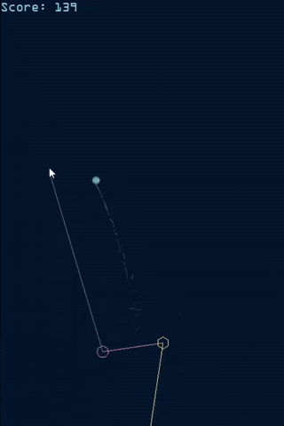
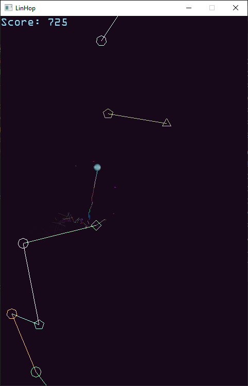
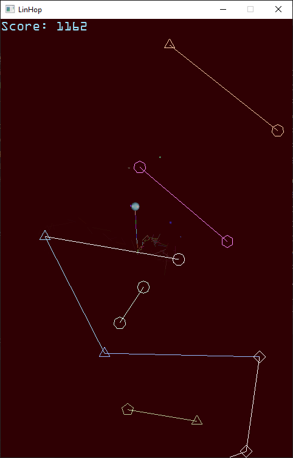

<p align="center">
  
</p>

# LinHop

A cross platform C++ game about a ball that seeks to reach the sky.

# Classic and Hidden

Can't jump on invisible lines? Well, there is a classic mode for you.

# Dependencies

All:
1. Graphics: stb_image
2. cglm, glm library

For PC only:
1. GLFW as window, input handler
2. GLEW as OpenGL wrapper
3. libsoundio as audio library

# Build
## Android
* You can use Android Studio to build game for Android
## Linux and Windows
1. Go to app/src/main/cpp (C/C++ project root).
2. Build the linhop CMake target.

Examples:
* Linux + GCC:
```console
mkdir build
cd build
cmake .. -G "Unix Makefiles"
cmake --build . --target linhop --config Release
```

* Windows + MSVC:
```console
mkdir build
cd build
cmake .. -G "Visual Studio 17 2022"
cmake --build . --target linhop --config Release
```

3. Place assets (audio, fonts, textures dirs) in executable working directory.

# Screenshots

<p align="center">
  
</p>
<p align="center">
  
</p>

# Credits
* The original was made by dafluffypotato. Link: https://dafluffypotato.itch.io/lynez
# Roadmap
* Audio playback on PC